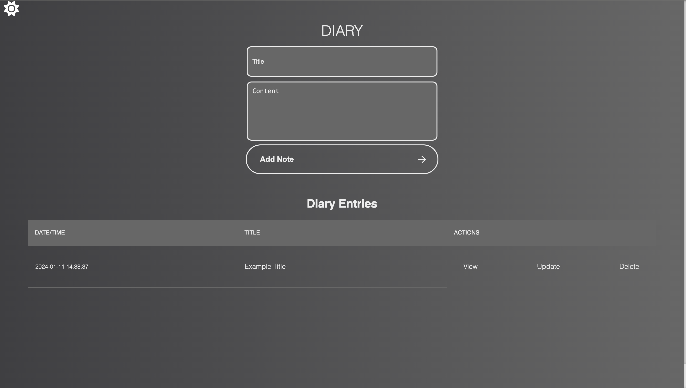

# Diary App

A personal diary application where users can create, view, update, and delete notes. The application is built using Flask, SQLAlchemy, HTML, CSS, and JavaScript.

## Features

- **CRUD Operations:** Create, Read, Update, and Delete diary entries.
- **Responsive Design:** A modern and responsive user interface for an optimal user experience.
- **Interactive Elements:** Smooth scrolling, dynamic dark/light theme switch, and on-scroll animations using JavaScript.
- **Theming:** Utilized CSS variables for easy theming.
- **Database:** Integrated SQLite database for storing diary entries.

## Technologies Used

- **Backend:** Flask, SQLAlchemy
- **Frontend:** HTML, CSS, JavaScript

## Getting Started

1. Clone the repository:

```bash
git clone https://github.com/your-username/diary-app.git
cd diary-app
```

2. Install dependencies:
```bash
pip install -r requirements.txt
```

3. Run the application:
```bash
python3 app.py
```

## Sample


## Contributing
Contributions are welcome! Feel free to open issues or submit pull requests.

## Licensing
This project is licensed under the MIT License.
